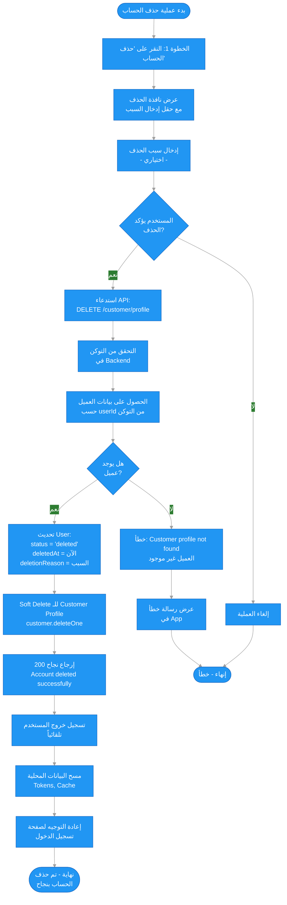
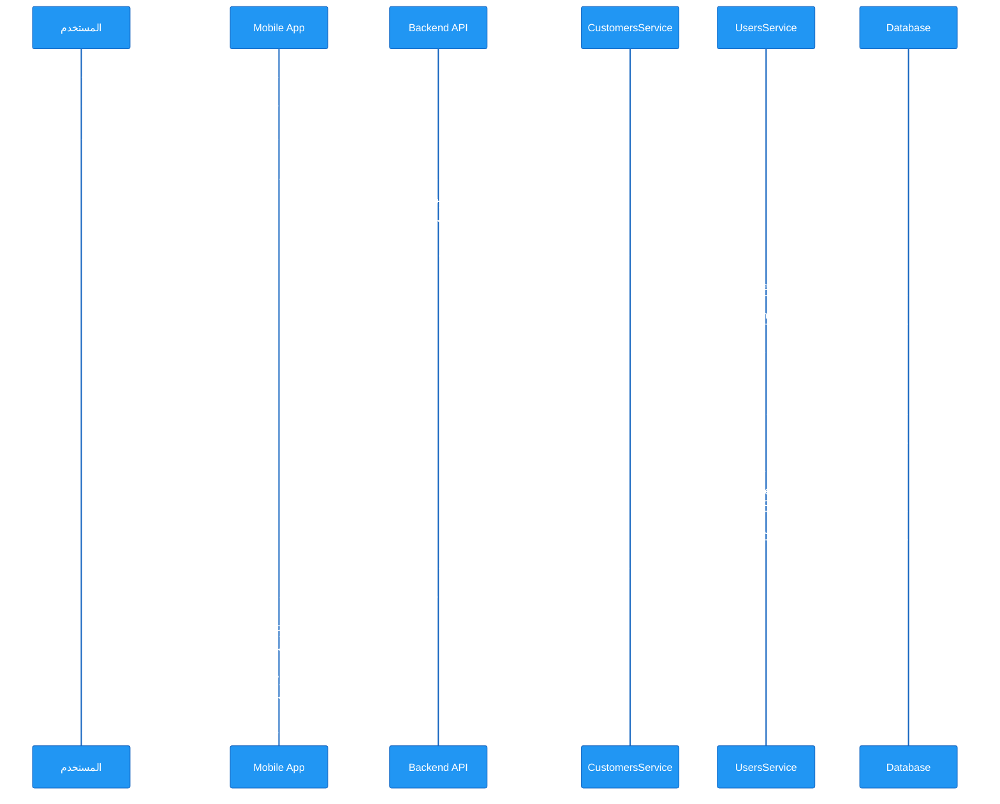

# 📋 مخطط سير عملية حذف الحساب

## 📝 نظرة عامة

هذا الملف يشرح عملية حذف الحساب من التطبيق. النظام يستخدم **Soft Delete** حيث يتم تحويل الحساب إلى حالة "محذوف" ويمنع الدخول دون حذف البيانات فعلياً.

العملية تتكون من **خطوة واحدة رئيسية**:
1. العميل يقدم طلب حذف الحساب مع إمكانية إدخال سبب الحذف (اختياري)
2. النظام يقوم بـ Soft Delete للحساب ويحفظ سبب الحذف في قاعدة البيانات
3. بعد الحذف، يتم منع دخول الحساب تلقائياً

---

## 🔐 الحقول المطلوبة

### طلب حذف الحساب (Delete Account)

1. **`reason`** - سبب الحذف (اختياري)
   - نوع: `string`
   - الطول الأقصى: 500 حرف
   - الوصف: السبب الذي دفع العميل لحذف حسابه

**ملاحظة**: السبب اختياري، لكن يُنصح بطلبه من المستخدم وفق سياسة Google.

---

## 📊 مخطط سير العمل (Mermaid Flowchart)



---

## 🔄 السيناريو التفصيلي

### 1️⃣ الخطوة 1: حذف الحساب (Delete Account)

#### أ) عرض نافذة الحذف

يتم عرض نافذة تأكيد تحتوي على:
- رسالة تأكيد: "هل أنت متأكد من حذف حسابك؟ هذا الإجراء لا يمكن التراجع عنه."
- حقل إدخال (اختياري): "سبب الحذف"
- زر إلغاء
- زر حذف (باللون الأحمر)

#### ب) التحقق من التوكن

```typescript
// التحقق من صحة التوكن في JwtAuthGuard
const token = request.headers.authorization?.split(' ')[1];
const user = await jwtService.verify(token);
```

#### ج) الحصول على بيانات العميل

```typescript
// البحث عن العميل حسب userId من التوكن
const customer = await customerModel.findOne({ userId: user.id });

if (!customer) {
  throw NotFoundException('Customer profile not found');
}
```

**❌ الخطأ 1: العميل غير موجود**
- الرسالة: `"Customer profile not found"`
- الكود: 404

#### د) تحديث حالة المستخدم (Soft Delete)

```typescript
// تحديث User: Soft Delete
const userId = typeof customer.userId === 'object' && customer.userId?._id
  ? customer.userId._id.toString()
  : customer.userId.toString();

await usersService.delete(userId, reason);

// في UsersService.delete()
user.status = 'deleted';
user.deletedAt = new Date();
if (reason) {
  user.deletionReason = reason;
}
await user.save();
```

**الحقول المحدثة**:
- `status`: يتغير من `'active'` إلى `'deleted'`
- `deletedAt`: يتم تعيين التاريخ والوقت الحالي
- `deletionReason`: يتم حفظ السبب إذا تم إدخاله

#### هـ) Soft Delete للـ Customer Profile

```typescript
// Soft Delete للـ Customer Profile
await customer.deleteOne();
```

**ملاحظة**: `deleteOne()` في Mongoose يقوم بـ Soft Delete إذا كان Schema يحتوي على `timestamps` و `deletedAt`، وإلا يقوم بحذف فعلي.

#### و) الاستجابة

```json
{
  "success": true,
  "data": null,
  "message": "Account deleted successfully",
  "messageAr": "تم حذف الحساب بنجاح"
}
```

---

### 2️⃣ الخطوة 2: منع الدخول بعد الحذف

بعد حذف الحساب، يتم منع الدخول تلقائياً عند محاولة تسجيل الدخول:

#### أ) محاولة تسجيل الدخول

```typescript
// في AuthService.login()
const user = await userModel.findOne({ phone }).select('+password');

if (!user) {
  throw UnauthorizedException('Invalid credentials');
}

// التحقق من حالة الحساب
if (user.status === 'deleted') {
  await this.logLoginAttempt({
    identifier: phone,
    identifierType: 'phone',
    ipAddress: ipAddress || 'unknown',
    userAgent,
    status: 'blocked',
    failureReason: 'Account deleted',
  });
  throw UnauthorizedException('Your account has been deleted');
}
```

**❌ الخطأ 2: محاولة دخول حساب محذوف**
- الرسالة: `"Your account has been deleted"`
- الكود: 401
- الحالة: `blocked` في سجل محاولات الدخول

---

### 3️⃣ الخطوة 3: تسجيل الخروج وإعادة التوجيه

بعد نجاح عملية الحذف في التطبيق:

#### أ) تسجيل الخروج التلقائي

```dart
// في Mobile App بعد نجاح الحذف
context.read<AuthCubit>().logout();
```

#### ب) مسح البيانات المحلية

```dart
// مسح Tokens و Cache
await localStorage.clear();
await secureStorage.clear();
```

#### ج) إعادة التوجيه

```dart
// إعادة التوجيه لصفحة تسجيل الدخول
context.go('/login');
```

---

## 📌 ملخص الأخطاء والحالات المرفوضة

### الخطوة 1: حذف الحساب

| # | الحالة | رسالة الخطأ | الكود | وصف |
|---|--------|-------------|-------|------|
| 1 | العميل غير موجود | `Customer profile not found` | 404 | لم يتم العثور على ملف العميل المرتبط بالمستخدم |
| 2 | غير مصرح | `Unauthorized` | 401 | التوكن غير صحيح أو منتهي الصلاحية |

### الخطوة 2: محاولة الدخول بعد الحذف

| # | الحالة | رسالة الخطأ | الكود | وصف |
|---|--------|-------------|-------|------|
| 3 | حساب محذوف | `Your account has been deleted` | 401 | محاولة تسجيل الدخول لحساب محذوف |

---

## 🔒 قواعد الأمان

### حذف الحساب

- **Soft Delete**: البيانات لا تُحذف فعلياً من قاعدة البيانات
- **الحفظ**: جميع البيانات تُحفظ للمراجعة والمحاسبة
- **السبب**: يُنصح بحفظ سبب الحذف لتحسين الخدمة
- **التحقق**: يجب التحقق من التوكن قبل الحذف
- **التأكيد**: يجب عرض نافذة تأكيد قبل الحذف

### منع الدخول

- **التحقق التلقائي**: يتم التحقق من حالة الحساب في `AuthService.login()`
- **الحالات المدعومة**: `pending`, `active`, `suspended`, `deleted`
- **تسجيل المحاولات**: يتم تسجيل محاولات الدخول للحسابات المحذوفة

### البيانات المحذوفة

- **User Schema**: 
  - `status`: يتغير إلى `'deleted'`
  - `deletedAt`: يتم تعيين التاريخ والوقت
  - `deletionReason`: يتم حفظ السبب (إذا تم إدخاله)
- **Customer Schema**: يتم Soft Delete باستخدام `deleteOne()`

---

## 🎯 الفرق بين Hard Delete و Soft Delete

### Hard Delete (الحذف الفعلي)
- يتم حذف البيانات نهائياً من قاعدة البيانات
- لا يمكن استرجاع البيانات
- يُستخدم للأمان أو الامتثال القانوني الصارم

### Soft Delete (الحذف اللين)
- يتم تغيير حالة الحساب فقط
- البيانات تبقى في قاعدة البيانات
- يمكن استرجاع البيانات إذا لزم الأمر
- **يستخدم في هذا النظام** حسب سياسة Google

---

## 📊 مخطط تدفق البيانات (Sequence Diagram)



---

## 🔗 مراجع

### API Endpoints (Customer)

- `DELETE /customer/profile` - حذف الحساب
  - **Headers**: `Authorization: Bearer <accessToken>`
  - **Body** (اختياري):
    ```json
    {
      "reason": "سبب الحذف (اختياري)"
    }
    ```
  - **Response**:
    ```json
    {
      "success": true,
      "data": null,
      "message": "Account deleted successfully",
      "messageAr": "تم حذف الحساب بنجاح"
    }
    ```

### API Endpoints (Authentication)

- `POST /auth/login` - محاولة تسجيل الدخول
  - **Error Response** (إذا كان الحساب محذوف):
    ```json
    {
      "success": false,
      "message": "Your account has been deleted",
      "messageAr": "تم حذف حسابك. الحالة: محذوف"
    }
    ```

---

## 📝 ملاحظات مهمة

### سياسة Google لحذف الحساب

وفق سياسة Google، يجب أن يتوفر:
- ✅ **قسم حذف الحساب** - موجود في صفحة الإعدادات
- ✅ **واجهة حذف الحساب** - موجودة مع حقل إدخال السبب
- ✅ **توضيح سبب الحذف** - حقل اختياري لإدخال السبب
- ✅ **Soft Delete** - البيانات لا تُحذف فعلياً
- ✅ **منع الدخول** - الحساب المحذوف لا يستطيع الدخول

### البيانات المحفوظة

بعد حذف الحساب، يتم الاحتفاظ بـ:
- ✅ بيانات User (مع `status: 'deleted'`)
- ✅ بيانات Customer Profile
- ✅ تاريخ الحذف (`deletedAt`)
- ✅ سبب الحذف (`deletionReason` - إذا تم إدخاله)

### البيانات المحمية

الحساب المحذوف لا يستطيع:
- ❌ تسجيل الدخول
- ❌ الوصول إلى أي وظائف في التطبيق
- ❌ استعادة الحساب (تلقائياً)

---

## 🛠️ التطبيق العملي

### Backend Implementation

**File**: `backend/src/modules/customers/customer-profile.controller.ts`

```typescript
@Delete('profile')
async deleteAccount(
  @CurrentUser() user: any,
  @Body() dto: DeleteAccountDto,
) {
  const customer = await this.customersService.findByUserId(user.id);
  
  if (!customer) {
    throw new NotFoundException('Customer profile not found');
  }
  
  await this.customersService.deleteAccount(
    customer._id.toString(),
    dto.reason,
  );
  
  return ResponseBuilder.success(
    null,
    'Account deleted successfully',
    'تم حذف الحساب بنجاح',
  );
}
```

### Mobile Implementation

**File**: `mobile/lib/features/settings/presentation/screens/settings_screen.dart`

```dart
void _showDeleteAccountDialog() {
  final reasonController = TextEditingController();
  final profileCubit = getIt<ProfileCubit>();

  showDialog(
    context: context,
    builder: (ctx) => BlocProvider.value(
      value: profileCubit,
      child: AlertDialog(
        title: const Text('حذف الحساب'),
        content: Column(
          mainAxisSize: MainAxisSize.min,
          children: [
            const Text('هل أنت متأكد من حذف حسابك؟'),
            TextField(
              controller: reasonController,
              decoration: InputDecoration(
                labelText: 'سبب الحذف (اختياري)',
              ),
              maxLines: 3,
            ),
          ],
        ),
        actions: [
          TextButton(
            onPressed: () => Navigator.pop(ctx),
            child: Text('إلغاء'),
          ),
          ElevatedButton(
            onPressed: () async {
              final success = await profileCubit.deleteAccount(
                reason: reasonController.text.trim().isEmpty 
                  ? null 
                  : reasonController.text.trim()
              );
              
              if (success) {
                context.read<AuthCubit>().logout();
                context.go('/login');
              }
            },
            child: const Text('حذف'),
          ),
        ],
      ),
    ),
  );
}
```

---

## ✅ الخلاصة

نظام حذف الحساب في التطبيق:
- ✅ يتوافق مع سياسة Google
- ✅ يستخدم Soft Delete للحفاظ على البيانات
- ✅ يحفظ سبب الحذف للمراجعة
- ✅ يمنع الدخول تلقائياً بعد الحذف
- ✅ يوفر واجهة سلسة للمستخدم
