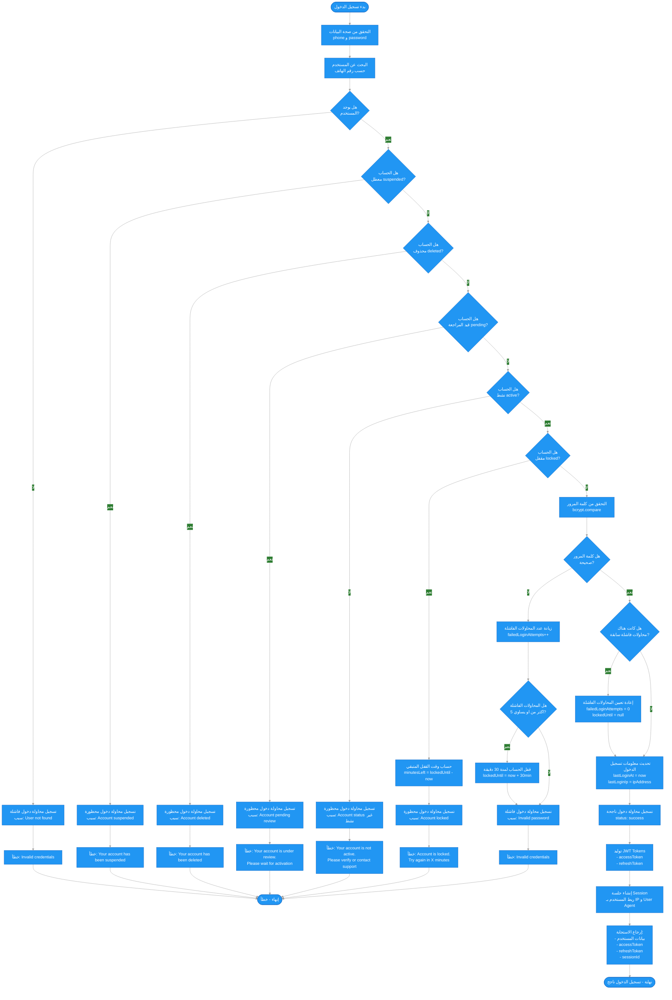

# 📋 مخطط سير عملية تسجيل الدخول

## 📝 نظرة عامة

هذا الملف يشرح الحقول المطلوبة لتسجيل الدخول من التطبيق وجميع الحالات والأخطاء التي قد تحدث أثناء العملية.

---

## 🔐 الحقول المطلوبة

### ✅ الحقول الإلزامية:

1. **`phone`** - رقم الهاتف
   - نوع: `string`
   - الصيغة: رقم دولي (مثال: `+966501234567`)
   - التحقق: يجب أن يكون بصيغة دولية صحيحة

2. **`password`** - كلمة المرور
   - نوع: `string`
   - لا يوجد حد أدنى في API (يتم التحقق من المطابقة فقط)

---

## 📊 مخطط سير العمل (Mermaid Flowchart)



---

## 🔄 السيناريو التفصيلي

### 1️⃣ التحقق من البيانات

```typescript
// التحقق من صحة رقم الهاتف
@IsString()
@IsNotEmpty()
@Matches(/^\+?[1-9]\d{1,14}$/)

// التحقق من وجود كلمة المرور
@IsString()
@IsNotEmpty()
```

### 2️⃣ البحث عن المستخدم

```typescript
const user = await userModel.findOne({ phone }).select('+password');

if (!user) {
  // تسجيل محاولة دخول فاشلة
  await logLoginAttempt({
    status: 'failed',
    failureReason: 'User not found'
  });
  throw UnauthorizedException('Invalid credentials');
}
```

**❌ الخطأ 1: المستخدم غير موجود**
- الحالة: `failed`
- الرسالة: `"Invalid credentials"`

---

### 3️⃣ التحقق من حالة الحساب (Account Status)

#### أ) حساب معطل (Suspended)

```typescript
if (user.status === 'suspended') {
  await logLoginAttempt({
    status: 'blocked',
    failureReason: 'Account suspended'
  });
  throw UnauthorizedException('Your account has been suspended');
}
```

**❌ الخطأ 2: الحساب معطل**
- الحالة: `blocked`
- الرسالة: `"Your account has been suspended"`

#### ب) حساب محذوف (Deleted)

```typescript
if (user.status === 'deleted') {
  await logLoginAttempt({
    status: 'blocked',
    failureReason: 'Account deleted'
  });
  throw UnauthorizedException('Your account has been deleted');
}
```

**❌ الخطأ 3: الحساب محذوف**
- الحالة: `blocked`
- الرسالة: `"Your account has been deleted"`

#### ج) حساب قيد المراجعة (Pending)

```typescript
if (user.status === 'pending') {
  await logLoginAttempt({
    status: 'blocked',
    failureReason: 'Account pending review'
  });
  throw UnauthorizedException(
    'Your account is under review. Please wait for activation'
  );
}
```

**❌ الخطأ 4: الحساب قيد المراجعة**
- الحالة: `blocked`
- الرسالة: `"Your account is under review. Please wait for activation"`

#### د) حساب غير نشط (غير active)

```typescript
if (user.status !== 'active') {
  await logLoginAttempt({
    status: 'blocked',
    failureReason: `Account status is ${user.status}`
  });
  throw UnauthorizedException(
    'Your account is not active. Please verify your account or contact support'
  );
}
```

**❌ الخطأ 5: الحساب غير نشط**
- الحالة: `blocked`
- الرسالة: `"Your account is not active. Please verify your account or contact support"`

---

### 4️⃣ التحقق من قفل الحساب (Account Lock)

```typescript
if (user.lockedUntil && user.lockedUntil > new Date()) {
  const minutesLeft = Math.ceil(
    (user.lockedUntil.getTime() - Date.now()) / 60000
  );
  await logLoginAttempt({
    status: 'blocked',
    failureReason: 'Account locked'
  });
  throw UnauthorizedException(
    `Account is locked. Try again in ${minutesLeft} minutes`
  );
}
```

**❌ الخطأ 6: الحساب مقفل**
- الحالة: `blocked`
- الرسالة: `"Account is locked. Try again in X minutes"`
- **ملاحظة:** يتم قفل الحساب بعد 5 محاولات فاشلة لمدة 30 دقيقة

---

### 5️⃣ التحقق من كلمة المرور

```typescript
const isPasswordValid = await comparePassword(password, user.password);

if (!isPasswordValid) {
  // زيادة المحاولات الفاشلة
  await handleFailedLogin(user);
  
  // تسجيل المحاولة الفاشلة
  await logLoginAttempt({
    status: 'failed',
    failureReason: 'Invalid password'
  });
  
  throw UnauthorizedException('Invalid credentials');
}
```

#### معالجة المحاولات الفاشلة:

```typescript
private async handleFailedLogin(user: UserDocument) {
  user.failedLoginAttempts += 1;

  // قفل الحساب بعد 5 محاولات فاشلة
  if (user.failedLoginAttempts >= 5) {
    user.lockedUntil = new Date(Date.now() + 30 * 60 * 1000); // 30 دقيقة
  }

  await user.save();
}
```

**❌ الخطأ 7: كلمة المرور خاطئة**
- الحالة: `failed`
- الرسالة: `"Invalid credentials"`
- **ملاحظة:** 
  - زيادة `failedLoginAttempts`
  - إذا وصلت المحاولات إلى 5، يتم قفل الحساب لمدة 30 دقيقة

---

### 6️⃣ نجاح تسجيل الدخول

#### أ) إعادة تعيين المحاولات الفاشلة

```typescript
if (user.failedLoginAttempts > 0) {
  user.failedLoginAttempts = 0;
  user.lockedUntil = undefined;
  await user.save();
}
```

#### ب) تحديث معلومات تسجيل الدخول

```typescript
user.lastLoginAt = new Date();
user.lastLoginIp = ipAddress;
await user.save();
```

#### ج) تسجيل المحاولة الناجحة

```typescript
await logLoginAttempt({
  status: 'success'
});
```

#### د) توليد JWT Tokens

```typescript
const tokens = await generateTokens(user);
// {
//   accessToken: "eyJhbGciOiJIUzI1NiIs...",
//   refreshToken: "eyJhbGciOiJIUzI1NiIs...",
//   expiresIn: "7d"
// }
```

#### هـ) إنشاء جلسة (Session)

```typescript
const session = await createSession(
  user._id,
  tokens.accessToken,
  ipAddress,
  userAgent
);
```

#### و) الاستجابة

```json
{
  "success": true,
  "data": {
    "user": {
      "id": "...",
      "phone": "+966501234567",
      "email": "user@example.com",
      "userType": "customer",
      "status": "active"
    },
    "accessToken": "eyJhbGciOiJIUzI1NiIs...",
    "refreshToken": "eyJhbGciOiJIUzI1NiIs...",
    "expiresIn": "7d",
    "sessionId": "507f1f77bcf86cd799439011"
  },
  "message": "Login successful",
  "messageAr": "تم تسجيل الدخول بنجاح"
}
```

---

## 📌 ملخص الأخطاء والحالات المرفوضة

| # | الحالة | رسالة الخطأ | الكود | وصف |
|---|--------|-------------|-------|------|
| 1 | المستخدم غير موجود | `Invalid credentials` | 401 | لم يتم العثور على مستخدم بهذا رقم الهاتف |
| 2 | حساب معطل | `Your account has been suspended` | 401 | الحساب في حالة `suspended` |
| 3 | حساب محذوف | `Your account has been deleted` | 401 | الحساب في حالة `deleted` |
| 4 | حساب قيد المراجعة | `Your account is under review. Please wait for activation` | 401 | الحساب في حالة `pending` (قيد انتظار موافقة المدير) |
| 5 | حساب غير نشط | `Your account is not active. Please verify your account or contact support` | 401 | الحساب في حالة غير `active` |
| 6 | حساب مقفل | `Account is locked. Try again in X minutes` | 401 | الحساب مقفل بسبب 5 محاولات فاشلة (30 دقيقة) |
| 7 | كلمة مرور خاطئة | `Invalid credentials` | 401 | كلمة المرور غير صحيحة (يزيد المحاولات الفاشلة) |

---

## 🔒 نظام قفل الحساب (Account Locking)

### القواعد:

1. **بداية المحاولات:**
   - عند كل محاولة فاشلة، يتم زيادة `failedLoginAttempts` بمقدار 1

2. **عند الوصول إلى 5 محاولات:**
   - يتم قفل الحساب تلقائياً
   - `lockedUntil = now + 30 minutes`
   - لا يمكن تسجيل الدخول حتى انتهاء المدة

3. **عند نجاح تسجيل الدخول:**
   - إعادة تعيين `failedLoginAttempts = 0`
   - إلغاء القفل `lockedUntil = null`

---

## 📝 تسجيل محاولات الدخول (Login Attempts Logging)

يتم تسجيل جميع محاولات الدخول في قاعدة البيانات:

### الحالات (Status):

- **`success`**: تسجيل الدخول نجح
- **`failed`**: فشل تسجيل الدخول (مستخدم غير موجود أو كلمة مرور خاطئة)
- **`blocked`**: تم منع تسجيل الدخول (حساب معطل/محذوف/مقفل/غير نشط)

### البيانات المسجلة:

```typescript
{
  identifier: "+966501234567",  // رقم الهاتف
  identifierType: "phone",      // نوع المعرف
  ipAddress: "192.168.1.1",     // عنوان IP
  userAgent: "Mozilla/5.0...",  // معلومات المتصفح
  status: "success" | "failed" | "blocked",
  failureReason: "Invalid password", // سبب الفشل (إن وجد)
  createdAt: Date
}
```

---

## 🔗 مراجع

- **API Endpoint**: `POST /auth/login`
- **DTO File**: `backend/src/modules/auth/dto/login.dto.ts`
- **Service File**: `backend/src/modules/auth/auth.service.ts` (دالة `login`)
- **التوثيق الكامل**: `docs/flutter-integration/auth.md`
