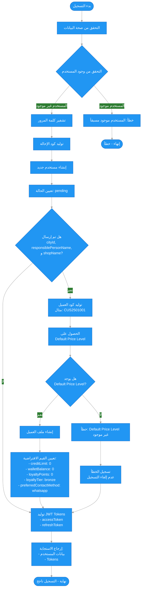

# 📋 مخطط سير عملية تسجيل حساب عميل

## 📝 نظرة عامة

هذا الملف يشرح الحقول المطلوبة والاختيارية لإنشاء حساب عميل من التطبيق والسيناريو الذي يتم تنفيذه.

---

## 🔐 الحقول المطلوبة

### ✅ الحقول الإلزامية:

1. **`phone`** - رقم الهاتف
   - نوع: `string`
   - الصيغة: رقم دولي (مثال: `+966501234567`)
   - التحقق: يجب أن يكون بصيغة دولية صحيحة

2. **`password`** - كلمة المرور
   - نوع: `string`
   - الحد الأدنى: 8 أحرف
   - الحد الأقصى: 50 حرف
   - الشروط:
     - حرف كبير واحد على الأقل (A-Z)
     - حرف صغير واحد على الأقل (a-z)
     - رقم واحد على الأقل (0-9)
     - رمز خاص واحد على الأقل (@$!%*?&)

3. **`userType`** - نوع المستخدم
   - نوع: `string`
   - القيمة: `"customer"` (للتطبيق)
   - القيم المسموحة: `['customer', 'admin']`

### 📋 الحقول الاختيارية:

4. **`email`** - البريد الإلكتروني
   - نوع: `string`
   - التحقق: صيغة بريد إلكتروني صحيحة

### 🏪 حقول ملف العميل (اختيارية ولكن يُنصح بها):

5. **`cityId`** - معرف المدينة
   - نوع: `string` (MongoDB ObjectId)
   - **مهم**: مطلوب لإنشاء ملف عميل كامل

6. **`responsiblePersonName`** - اسم الشخص المسؤول
   - نوع: `string`

7. **`shopName`** - اسم المتجر
   - نوع: `string`

8. **`shopNameAr`** - اسم المتجر بالعربية
   - نوع: `string`

9. **`businessType`** - نوع العمل
   - نوع: `string`
   - القيم المسموحة: `['shop', 'technician', 'distributor', 'other']`
   - القيمة الافتراضية: `'shop'`

---

## 📊 مخطط سير العمل (Mermaid Flowchart)



---

## 🔄 السيناريو التفصيلي

### 1️⃣ التحقق من البيانات

- التحقق من صحة الحقول المطلوبة
- التحقق من صيغة رقم الهاتف
- التحقق من شروط كلمة المرور
- التحقق من صحة البريد الإلكتروني (إن وجد)

### 2️⃣ التحقق من وجود المستخدم

```typescript
// البحث عن مستخدم موجود بنفس رقم الهاتف أو البريد الإلكتروني
const existingUser = await userModel.findOne({
  $or: [{ phone }, ...(email ? [{ email }] : [])]
});

if (existingUser) {
  throw ConflictException('User with this phone or email already exists');
}
```

### 3️⃣ إنشاء المستخدم (User)

- تشفير كلمة المرور باستخدام bcrypt
- توليد كود الإحالة (Referral Code)
- إنشاء سجل المستخدم بالبيانات التالية:

```typescript
{
  phone: "+966501234567",
  email: "user@example.com", // اختياري
  password: "hashed_password",
  userType: "customer",
  referralCode: "ABC12345",
  status: "pending" // سيتم تفعيله بعد موافقة المدير
}
```

### 4️⃣ إنشاء ملف العميل (Customer Profile)

**⚠️ يتم فقط إذا تم إرسال `cityId` و `responsiblePersonName` و `shopName`**

#### أ) توليد كود العميل
- الصيغة: `CUS + سنة (2 أرقام) + شهر (2 أرقام) + رقم تسلسلي (4 أرقام)`
- مثال: `CUS2501001`

#### ب) الحصول على Default Price Level
- البحث عن مستوى السعر الافتراضي (isDefault: true, isActive: true)
- إذا لم يوجد: خطأ ولا يتم إلغاء التسجيل (يتم تسجيل الخطأ فقط)

#### ج) إنشاء ملف العميل

```typescript
{
  userId: user._id,
  customerCode: "CUS2501001",
  responsiblePersonName: "أحمد علي",
  shopName: "Phone Repair Center",
  shopNameAr: "مركز صيانة الجوالات",
  cityId: ObjectId("..."),
  businessType: "shop" || businessType,
  priceLevelId: defaultPriceLevel._id,
  creditLimit: 0,
  walletBalance: 0,
  loyaltyPoints: 0,
  loyaltyTier: "bronze",
  preferredContactMethod: "whatsapp"
}
```

### 5️⃣ توليد JWT Tokens

- إنشاء `accessToken` (انتهاء الصلاحية: حسب إعدادات JWT_EXPIRATION)
- إنشاء `refreshToken` (انتهاء الصلاحية: 30 يوم)
- إرجاع Tokens مع بيانات المستخدم

### 6️⃣ الاستجابة

```json
{
  "success": true,
  "data": {
    "user": {
      "id": "...",
      "phone": "+966501234567",
      "email": "user@example.com",
      "userType": "customer",
      "status": "pending",
      "referralCode": "ABC12345"
    },
    "accessToken": "eyJhbGciOiJIUzI1NiIs...",
    "refreshToken": "eyJhbGciOiJIUzI1NiIs...",
    "expiresIn": "7d"
  },
  "message": "User registered successfully",
  "messageAr": "تم تسجيل المستخدم بنجاح"
}
```

---

## 📌 ملاحظات مهمة

### حالة المستخدم (Status)

- **`pending`**: الحالة الافتراضية عند التسجيل
- المستخدم لا يستطيع تسجيل الدخول حتى يتم تفعيل الحساب من قبل المدير
- بعد الموافقة من المدير: `status` → `active`

### إنشاء ملف العميل

- **إذا تم إرسال البيانات الكاملة** (`cityId`, `responsiblePersonName`, `shopName`):
  - يتم إنشاء ملف العميل تلقائياً
  - يتم توليد كود العميل
  - يتم ربط المستخدم بمستوى السعر الافتراضي

- **إذا لم يتم إرسال البيانات الكاملة**:
  - يتم إنشاء حساب المستخدم فقط
  - لا يتم إنشاء ملف العميل
  - يمكن إكمال ملف العميل لاحقاً

### معالجة الأخطاء

- إذا فشل إنشاء ملف العميل، يتم تسجيل الخطأ فقط
- **لا يتم إلغاء تسجيل المستخدم** (User registration succeeds)
- يمكن للمستخدم إكمال ملف العميل لاحقاً

---

## 🔗 مراجع

- **API Endpoint**: `POST /auth/register`
- **DTO File**: `backend/src/modules/auth/dto/register.dto.ts`
- **Service File**: `backend/src/modules/auth/auth.service.ts`
- **التوثيق الكامل**: `docs/flutter-integration/auth.md`
