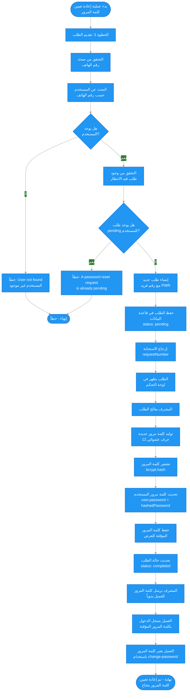

# 📋 مخطط سير عملية إعادة تعيين كلمة المرور

## 📝 نظرة عامة

هذا الملف يشرح عملية إعادة تعيين كلمة المرور (Forgot Password) من التطبيق. تم تحويل النظام من نظام OTP الآلي إلى نظام طلبات يدوية تتم إدارتها من لوحة التحكم.

العملية تتكون من **خطوتين رئيسيتين**:
1. العميل يقدم طلب إعادة تعيين كلمة المرور
2. المشرف يعالج الطلب ويرسل كلمة المرور الجديدة للعميل يدوياً
3. العميل يغير كلمة المرور بعد تسجيل الدخول بالكلمة المؤقتة

---

## 🔐 الحقول المطلوبة

### الخطوة 1: تقديم طلب إعادة تعيين كلمة المرور (Request Password Reset)

1. **`phone`** - رقم الهاتف
   - نوع: `string`
   - الصيغة: رقم دولي (مثال: `+966501234567`)
   - التحقق: يجب أن يكون بصيغة دولية صحيحة

2. **`customerNotes`** - ملاحظات العميل (اختياري)
   - نوع: `string`
   - وصف: ملاحظات إضافية من العميل حول الطلب

---

## 📊 مخطط سير العمل (Mermaid Flowchart)



---

## 🔄 السيناريو التفصيلي

### 1️⃣ الخطوة 1: تقديم طلب إعادة تعيين كلمة المرور (Request Password Reset)

#### أ) التحقق من صحة رقم الهاتف

```typescript
@IsString()
@IsNotEmpty()
@Matches(/^\+?[1-9]\d{1,14}$/)
phone: string;
```

#### ب) البحث عن المستخدم

```typescript
const user = await userModel.findOne({ phone });

if (!user) {
  throw BadRequestException('User not found');
}
```

**❌ الخطأ 1: المستخدم غير موجود**
- الرسالة: `"User not found"`
- الكود: 400

#### ج) التحقق من وجود طلب قيد الانتظار

```typescript
const existingRequest = await passwordResetRequestModel.findOne({
  customerId: user._id,
  status: 'pending',
});

if (existingRequest) {
  throw ConflictException(
    'A password reset request is already pending. Please wait for admin to process it.'
  );
}
```

**❌ الخطأ 2: طلب قيد الانتظار موجود**
- الرسالة: `"A password reset request is already pending. Please wait for admin to process it."`
- الكود: 409

#### د) إنشاء الطلب

```typescript
// توليد رقم الطلب (PWR + سنة + شهر + رقم تسلسلي)
const requestNumber = await generatePasswordResetRequestNumber(); // مثال: "PWR24120001"

// إنشاء طلب جديد
const request = await passwordResetRequestModel.create({
  requestNumber,
  customerId: user._id,
  phone: user.phone,
  status: 'pending',
  customerNotes: customerNotes || undefined,
});
```

#### هـ) الاستجابة

```json
{
  "success": true,
  "data": {
    "requestNumber": "PWR24120001",
    "status": "pending"
  },
  "message": "Password reset request submitted successfully. An admin will contact you soon.",
  "messageAr": "تم تقديم طلب إعادة تعيين كلمة المرور بنجاح. سيتم التواصل معك قريباً."
}
```

---

### 2️⃣ الخطوة 2: معالجة الطلب من لوحة التحكم (Admin Process Request)

#### أ) المشرف يعرض الطلبات في لوحة التحكم

- **Endpoint (Admin)**: `GET /auth/admin/password-reset-requests`
- **فلترة**: حسب الحالة (`pending`, `completed`, `rejected`)
- **الصلاحيات**: يجب أن يكون المشرف مسجلاً دخول

#### ب) المشرف يعالج الطلب

**Endpoint (Admin)**: `POST /auth/admin/password-reset-requests/:id/process`

**Request Body (اختياري)**:
```json
{
  "adminNotes": "تم معالجة الطلب وإرسال كلمة المرور للعميل عبر واتساب"
}
```

**Workflow في Backend**:

```typescript
// 1. البحث عن الطلب
const request = await passwordResetRequestModel.findById(requestId);

if (!request || request.status !== 'pending') {
  throw BadRequestException('Request not found or already processed');
}

// 2. توليد كلمة مرور مؤقتة (12 حرف)
const temporaryPassword = generateTemporaryPassword(); // مثال: "Xy9@mP2kL$w"

// 3. تشفير كلمة المرور
const hashedPassword = await bcrypt.hash(temporaryPassword, 12);

// 4. تحديث كلمة مرور المستخدم
user.password = hashedPassword;
await user.save();

// 5. تحديث الطلب
request.status = 'completed';
request.temporaryPassword = hashedPassword;
request.temporaryPasswordPlain = temporaryPassword; // لحفظ مؤقت للعرض
request.processedBy = adminId;
request.processedAt = new Date();
request.adminNotes = adminNotes || undefined;
await request.save();
```

#### ج) الاستجابة للمشرف

```json
{
  "success": true,
  "data": {
    "request": {
      "_id": "...",
      "requestNumber": "PWR24120001",
      "status": "completed",
      "phone": "+966501234567",
      ...
    },
    "temporaryPassword": "Xy9@mP2kL$w"
  },
  "message": "Password reset request processed successfully. Please send the temporary password to the customer.",
  "messageAr": "تم معالجة طلب إعادة تعيين كلمة المرور بنجاح. يرجى إرسال كلمة المرور المؤقتة للعميل."
}
```

**⚠️ ملاحظة مهمة**: 
- كلمة المرور المؤقتة `temporaryPasswordPlain` تُعرض للمشرف في لوحة التحكم للنسخ والإرسال يدوياً
- يجب على المشرف إرسال كلمة المرور للعميل عبر واتساب/إيميل/هاتف
- كلمة المرور المؤقتة يجب أن تُحذف بعد فترة من الزمن (أو بعد استخدامها)

#### د) رفض الطلب (اختياري)

**Endpoint (Admin)**: `POST /auth/admin/password-reset-requests/:id/reject`

**Request Body**:
```json
{
  "rejectionReason": "لم يتم التحقق من هوية العميل",
  "adminNotes": "يرجى التواصل مع الدعم الفني مباشرة"
}
```

---

### 3️⃣ الخطوة 3: العميل يغير كلمة المرور (Change Password)

بعد أن يستلم العميل كلمة المرور المؤقتة من المشرف:

#### أ) تسجيل الدخول بالكلمة المؤقتة

- **Endpoint**: `POST /auth/login`
- **Phone**: رقم الهاتف
- **Password**: كلمة المرور المؤقتة المرسلة من المشرف

#### ب) تغيير كلمة المرور

- **Endpoint**: `PATCH /auth/change-password`
- **Headers**: `Authorization: Bearer <accessToken>`

**Request Body**:
```json
{
  "oldPassword": "Xy9@mP2kL$w",
  "newPassword": "NewStrongP@ss123"
}
```

**Validation لكلمة المرور الجديدة**:
- الحد الأدنى: 8 أحرف
- الحد الأقصى: 50 حرف
- يجب أن تحتوي على:
  - حرف كبير واحد على الأقل (A-Z)
  - حرف صغير واحد على الأقل (a-z)
  - رقم واحد على الأقل (0-9)
  - رمز خاص واحد على الأقل (@$!%*?&)

---

## 📌 ملخص الأخطاء والحالات المرفوضة

### الخطوة 1: تقديم طلب إعادة تعيين كلمة المرور

| # | الحالة | رسالة الخطأ | الكود | وصف |
|---|--------|-------------|-------|------|
| 1 | المستخدم غير موجود | `User not found` | 400 | لم يتم العثور على مستخدم بهذا رقم الهاتف |
| 2 | طلب قيد الانتظار موجود | `A password reset request is already pending. Please wait for admin to process it.` | 409 | يوجد بالفعل طلب قيد الانتظار لهذا المستخدم |

### الخطوة 2: معالجة الطلب (Admin)

| # | الحالة | رسالة الخطأ | الكود | وصف |
|---|--------|-------------|-------|------|
| 3 | الطلب غير موجود | `Password reset request not found` | 400 | لم يتم العثور على الطلب |
| 4 | الطلب تم معالجته مسبقاً | `Request is already [status]. Cannot process it again.` | 400 | الطلب تم معالجته أو رفضه مسبقاً |

### الخطوة 3: تغيير كلمة المرور

| # | الحالة | رسالة الخطأ | الكود | وصف |
|---|--------|-------------|-------|------|
| 5 | كلمة المرور الحالية غير صحيحة | `Current password is incorrect` | 400 | كلمة المرور المؤقتة غير صحيحة |
| 6 | كلمة المرور الجديدة مماثلة للقديمة | `New password must be different from current password` | 400 | يجب أن تكون كلمة المرور الجديدة مختلفة |
| 7 | كلمة المرور لا تحقق الشروط | `Password validation failed` | 400 | كلمة المرور لا تحقق الشروط المطلوبة |

---

## 🔒 قواعد الأمان

### طلبات إعادة تعيين كلمة المرور

- **الحالات المتاحة**: `pending`, `completed`, `rejected`
- **منع الطلبات المكررة**: لا يمكن إنشاء طلب جديد إذا كان هناك طلب `pending` موجود
- **أمان كلمة المرور المؤقتة**: 
  - يتم تشفير كلمة المرور المؤقتة في قاعدة البيانات
  - كلمة المرور المؤقتة (`temporaryPasswordPlain`) تُحفظ مؤقتاً للعرض فقط
  - يجب على المشرف حذف/عدم حفظ كلمة المرور بعد إرسالها للعميل

### توليد كلمة المرور المؤقتة

- **الطول**: 12 حرف
- **المحتوى**: مزيج عشوائي من:
  - أحرف كبيرة (A-Z)
  - أحرف صغيرة (a-z)
  - أرقام (0-9)
  - رموز خاصة (@$!%*?&)
- **الضمان**: يحتوي على حرف كبير، حرف صغير، رقم، ورمز خاص على الأقل

### شروط كلمة المرور الجديدة

- **الحد الأدنى**: 8 أحرف
- **الحد الأقصى**: 50 حرف
- **الشروط**:
  - حرف كبير واحد على الأقل (A-Z)
  - حرف صغير واحد على الأقل (a-z)
  - رقم واحد على الأقل (0-9)
  - رمز خاص واحد على الأقل (@$!%*?&)

---

## 🎯 الفرق بين النظام القديم والجديد

### النظام القديم (OTP)
- 3 خطوات: إرسال OTP → التحقق من OTP → تعيين كلمة مرور جديدة
- تلقائي بالكامل
- لا يتطلب تدخل المشرف

### النظام الجديد (Manual Request)
- خطوتان: تقديم طلب → معالجة المشرف + تغيير كلمة المرور
- يتطلب تدخل المشرف
- يوفر تحكم أفضل وأمان أعلى
- يسمح بمراجعة الطلبات قبل المعالجة

---

## 🔗 مراجع

- **API Endpoints (Customer)**:
  - `POST /auth/request-password-reset` - تقديم طلب إعادة تعيين كلمة المرور
  - `PATCH /auth/change-password` - تغيير كلمة المرور (بعد تسجيل الدخول)

- **API Endpoints (Admin)**:
  - `GET /auth/admin/password-reset-requests` - قائمة طلبات إعادة تعيين كلمة المرور
  - `GET /auth/admin/password-reset-requests/:id` - تفاصيل طلب محدد
  - `POST /auth/admin/password-reset-requests/:id/process` - معالجة الطلب
  - `POST /auth/admin/password-reset-requests/:id/reject` - رفض الطلب

- **التوثيق الكامل**: `docs/flutter-integration/auth.md`
